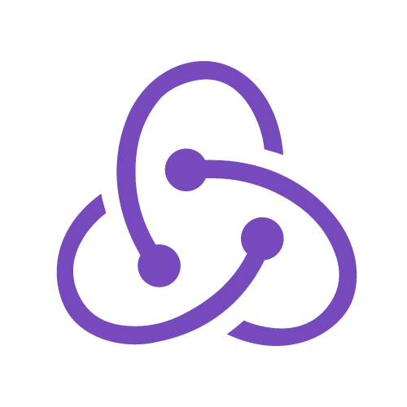

<h1 align="center">Hi 👋, I'm Mahadeb Sen</h1>
<h3 align="center">A passionate React.js developer from India</h3>

  

- 🔭 **I’m currently working -** In [AIMonk Labs Pvt. Ltd.](https://aimonk.com/)

- 🌱 **I’m currently learning -** [Next.js](https://nextjs.org/)

- 👨‍💻 **All of my projects are available Here -** On my [GitHub](https://github.com/MahadebSen) and my [Portfolio](https://portfolio-a8fff.web.app/)

- 👯 **I’m looking -** To collaborate on open source projects.

- 📄 **Know about my experiences -** My [Resume](https://drive.google.com/file/d/184_ymrC3YyqNvnJkz4lIdga79Rj_Ke_4/view?usp=sharing)

- 💬 **Ask me about anything -** [Gmail](mahadebsen237@gmail.com)
   

<h2 align="left">📫 Reach me out</h2>

    

 

<h2 align="left">💻 Technologies that I know</h2>
 

    
     
    
    
    

    
    
     
      
    
     

     
     

     
     
     
     
     

<h2 align="left">📈 Current Stats</h2>
 

&nbsp;

